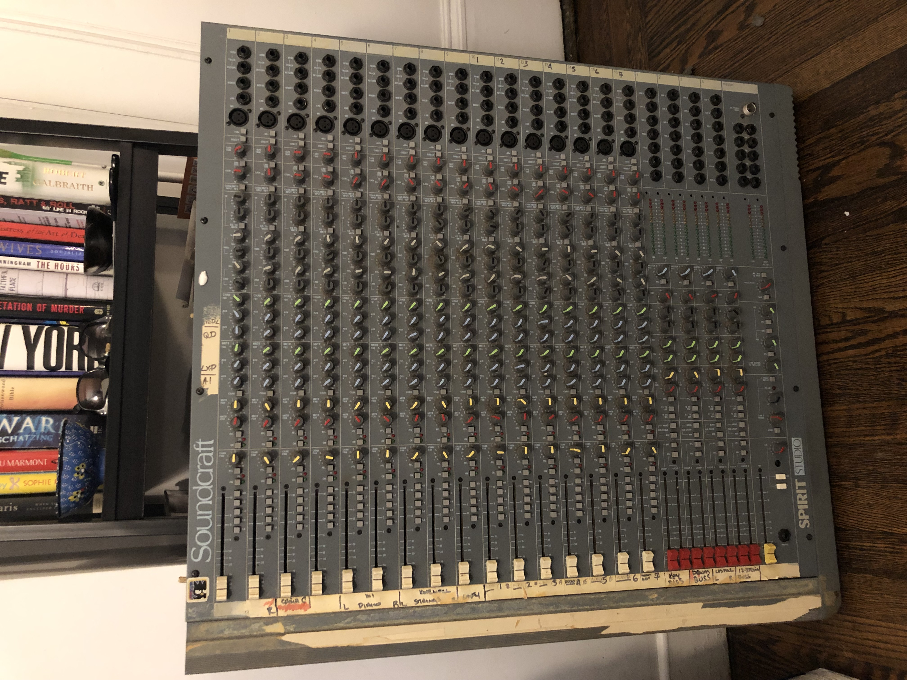

# Soundcraft Spirit Studio Restoration

Tom Dial

## Background

The Soundcraft Spirit Studio recording console was originally released in 1990.
According to my research, two frame sizes were provided: a 16 channel frame
and a 24 channel frame. Targeting the home studio market, the Spirit Studio was
an "inline" console where each channel has dual inputs: mic/line, and tape
return.

The console also features direct outputs on each channel, 8 group buses, 4-band
EQ including two parametric bands (and the EQ's can be split between mic/line
and tape returns as well), and a host of effects sends as well as two
"foldback" monitor mix sends. All in all, the feature list is quite impressive!

A console of this type was likely to be paired with a semi-pro 8-track recorder
such as those available from Tascam. but around the same time, Alesis released
the ADAT, which put digital multitrack recording in the hands of the masses for
the first time. Since ADATs could be linked together with sample-accurate
synchronization, 16 and even 24 track studios came into reach for serious home
musicians and project studios, and along with completely hard-disk / DAW based
systems, were probably the death knell for some small professional
studios (citation needed.)

For years, I've operated without a hardware mixer, opting instead to expand my
I/O capabilities and record synths directly into Pro Tools and Logic. However,
when I became interested in the craft of mixing, I noted that many of the
engineers I admired had "grown up" in the era of analog consoles and had
developed plenty of intuition in terms of gain staging and EQ by using analog
consoles in the past (even when many of them have since moved on.)

So, because I love electronics projects, I decided to buy a reasonably decent
analog mixer cheaply and restore it. Furthermore, I decided to document the
restoration project so that interested parties may learn from my experience
and potentially, avoid my mistakes!

## Before you Start

If you're planning on a console restoration project, I already have a few
suggestions for things that you should consider.

* **Join forums**  These days, there are plenty of online forums for people
  with similar interests. Forums *can* be a good place to learn about the
  pros and cons of various pieces of gear. I say "can" because there are
  also a significant number of people who speak with authority who actually
  have no idea what they are talking about, so be cautious. For me, the key
  value of forums is gaining insight into potential pitfalls, common
  issues, and potentially, sources of spare parts.

* **Shop locally**  Recording consoles like this are large and
  heavy. Even the sixteen channel console that I am restoring is large,
  and I ended up paying $100 just in shipping. This was greatly offset by
  the low price that I paid, but I'd encourage you to shop locally where
  possible for two reasons. First, shipping costs. Second, you'll have
  the opportunity to test the console out and see its condition before
  purchasing and incurring shipping costs. In my case, I really lucked
  out as the console functioned very well (nothing broken, at least) and
  wasn't missing any knobs, sliders, etc.

* **Make sure you have schematics** Schematics *can* be hard to find but
  are necessary if you truly need to dig in with the restoration. They are
  also very interesting to read and may give you good ideas if you're
  interested in building projects of your own design.

* **Consider parts availability**  Parts for some consoles can be hard to
  locate. A friend of mine has a Calrec console that uses ICs that are
  no longer being made. Obtaining spares will be expensive. By contrast,
  the Spirit Studio uses (mostly) still-available op-amps.

* **Ensure the power supply is reliable**  Semi-pro and professional
  consoles will typically have external power supplies. If you're working
  on an older console, you will want to make sure that the power supply is
  in good shape before powering on. While a quality power supply will
  provide adequate protection for faults, it would be bad news if, for
  example, one of the power rails in a bipolar supply failed and the
  other one remained functional. Check large electrolytic capacitors
  (more on that later) and replace if bulging, leaking, etc. 

  **NOTE:** I've seen some consoles for sale *without* their power
  supplies. I would be wary of this. If the seller doesn't have the power
  supply, there is no real way for you to test it. Additionally, these
  power supplies are speciality items and often sell on eBay for
  hundreds of dollars. I got my console (and power supply) for less than
  what other people are selling their power supplies for on eBay!

* **Have the correct tools, know how to use them**  Restoration of a
  console will generally require some parts to be repaired or replaced.
  This, in turn, requires desoldering and soldering. You need to have
  the right tools as well the expertise for this. If you don't, you have
  two options: pay a qualified tech, or teach yourself. If you opt for
  the latter, practice using the tools and techniques on old circuit
  boards before touching any gear you care about. I would *strongly*
  encourage someone undertaking a restoration to spend the time learning
  how to do these things yourself. Otherwise, whatever you think it
  will cost to restore the console will be multiplied by some factor.

* **Establish a budget**  I alluded to this above, but restoration of
  a console can and will get costly. For example, I am considering
  whether to "re-cap" the Spirit Studio. If I do, it's going to involve
  replacing in the area of, say, 500 capacitors give or take. Not only
  will this get expensive, it may actually be hard to source the caps
  given the supply-chain shortages in 2021.  If you're new to analog
  consoles, the budget will also include cabling to integrate it into
  your system. You may also need to upgrade your computer interface
  (assuming you use a DAW-based system) to add channels in support of
  integrating the analog console.

## Structure of this document

Following the project introduction, this document is divided into several
sections. First, the **Resources** section, which is presented at the top so
that anyone looking for schematics or information presented in the journal
can find them without scrolling through the work log.

Second, the **Work Log** section presents notes on my progress with the
restoration over time. These are organized as journal entries in reverse date
order, with most recent entries at the top. This may prove to be a poor
choice, but I've elected to order things this way so that people keeping
up-to-date don't have to scroll so much.

I've also included, for each post, the *estimated* time that it took for me
to complete the step as documented. This should be interesting when it comes
time to compose a final cost tally for the project.

**Note that due to time constraints, my entries are sometimes delayed and
will not be updated in real-time necessarily.**

## Resources
[Soundcraft Spirit Studio Schematics](assets/soundcraft-spirit-studio-schematics.pdf)

## Work Log

### 06 September 2021 - Checking Things Out - 4.0 Hours

[Soundcraft Spirit with Clipboard](assets/checklist-1.jpg)

As noted, I am behind on documenting progress with the restoration project,
but am working through the backlog. The entry for this day documents going
through the console's features to see what, if any, trouble spots exist.

And this console has a lot of things to test. A total of 16 input modules,
each with a mic/line preamp, tape return, insert, and direct out. Also a
routing matrix to the group buses, 4-band equalization, dual input/tape
signal paths, aux sends...The list goes on.

I am a huge fan of checklists, which I find incredibly useful in managing
software projects at my day job as well as just my overall day-to-day. So, I
created a task list with the goal of checking every single function of the
console prior to disassembly. With so many things going on, it would really
be impossible to keep it all in my head. 

Here's what it looked like:

[Spreadsheet with Feature Checklist](assets/checklist-2.jpg)

This picture was taken before I was done. I made an attempt to capture
every single feature of the board (the picture merely depicts some of the
features for an input module) and then went through, channel by channel,
feature by feature, and marked the sheet accordingly.

I was pretty astonished by the end to find that the console has no faults
except for the occasional scratchy switch and/or dirty potentionmeter. All
the connectors, switches, pots, faders, LEDs and features work as
expected. It's almost hard to believe, given that this console is 30 years
old, but I'll take all the good news I can get!

One thing I noticed while inspecting further is that the console has been
dropped at some point, perhaps even during its most recent shipment. However,
Nothing internally seems to have been damaged, and I am pretty sure that I
will be able to bend the heavy gauge metal back into shape with some
stratgic use of clamps and blocks of wood, etc.

### 25 August 2021 - Arrival - 0.5 Hours

The console arrived today, and I had some help unboxing it from my Corgi pal,
Stanley, who does not look like he approves of the purchase in this picture.
Perhaps he thinks it will mean less time spent with him?

Despite the fact that I knew the dimensions of the console ahead of time, I was
rather surprised at its size. I was also surprised by what seems like extremely
robust, thick-gauge steel construction. While I've seen some considerable shade
thrown at the Spirit Studio in forums, often times I feel like people are
conflating them with later plastic models that are targeted at more budget
studios. 

Case in point, [This article](http://www.muzines.co.uk/articles/soundcraft-spirit-studio/827)
from June 1991 lists the price of the 16 channel console as 1651 GBP, which in
1991, according to some spot currency rates from that time, translated to $2734
USD, which adjusted for inflation translates to approximately $5257 in 2021
dollars!

So, this was not a casual purchase for anyone in 1991, and was not strictly a
budget console either. In fact, it is on par, price-wise, with a Toft Audio
Designs ATB16, which is probably the closest thing that you can find to the
Spirit Studio 16 today.

Here it is out of the box (above.)  

