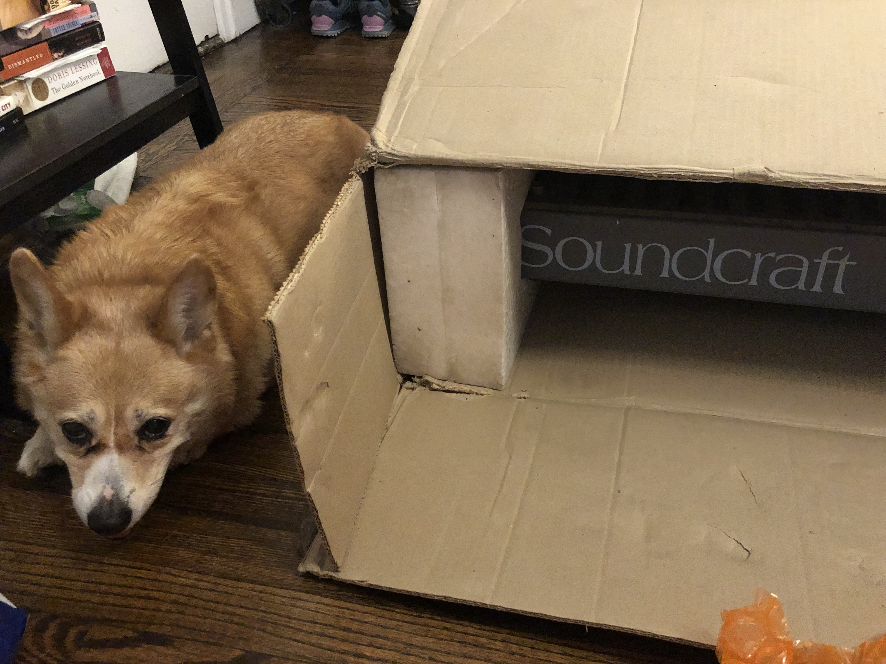
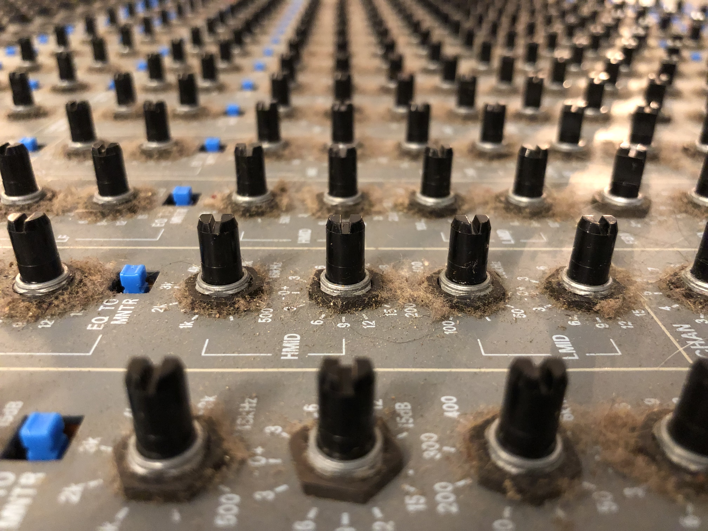

# Soundcraft Spirit Studio Restoration

Thomas R. Dial

## Index

* [Background](#background)
* [Before You Start](#before-you-start)
* [Work Log](#work-log)
  * [It Arrives](#it-arrives)
  * [Checking Things Out](#checking-things-out)
  * [Capacitors](#capacitors)
  * [Disassembly](#disassembly)
* [Resources](#resources)

## Background

The Soundcraft Spirit Studio recording console was originally released in 1990.
According to my research, two frame sizes were provided: a 16 channel frame
and a 24 channel frame. Targeting the home studio market, the Spirit Studio was
an "inline" console where each channel has dual inputs: mic/line, and tape
return.

The console also features direct outputs on each channel, 8 group buses, 4-band
EQ including two parametric bands (and the EQ's can be split between mic/line
and tape returns as well), and a host of effects sends as well as two
"foldback" monitor mix sends. All in all, the feature list is quite impressive!

A console of this type was likely to be paired with a semi-pro 8-track recorder
such as those available from Tascam. but around the same time, Alesis released
the ADAT, which put digital multitrack recording in the hands of the masses for
the first time. Since ADATs could be linked together with sample-accurate
synchronization, 16 and even 24 track studios came into reach for serious home
musicians and project studios, and along with completely hard-disk / DAW based
systems, were probably the death knell for some small professional
studios (citation needed.)

For years, I've operated without a hardware mixer, opting instead to expand my
I/O capabilities and record synths directly into Pro Tools and Logic. However,
when I became interested in the craft of mixing, I noted that many of the
engineers I admired had "grown up" in the era of analog consoles and had
developed plenty of intuition in terms of gain staging and EQ by using analog
consoles in the past (even when many of them have since moved on.)

So, because I love electronics projects, I decided to buy a reasonably decent
analog mixer cheaply and restore it. Furthermore, I decided to document the
restoration project so that interested parties may learn from my experience
and potentially, avoid my mistakes!

## Before You Start

If you're planning on a console restoration project, I already have a few
suggestions for things that you should consider.

* **Join forums**  These days, there are plenty of online forums for people
  with similar interests. Forums *can* be a good place to learn about the
  pros and cons of various pieces of gear. I say "can" because there are
  also a significant number of people who speak with authority who actually
  have no idea what they are talking about, so be cautious. For me, the key
  value of forums is gaining insight into potential pitfalls, common
  issues, and potentially, sources of spare parts.

* **Shop locally**  Recording consoles like this are large and
  heavy. Even the sixteen channel console that I am restoring is large,
  and I ended up paying $100 just in shipping. This was greatly offset by
  the low price that I paid, but I'd encourage you to shop locally where
  possible for two reasons. First, shipping costs. Second, you'll have
  the opportunity to test the console out and see its condition before
  purchasing and incurring shipping costs. In my case, I really lucked
  out as the console functioned very well (nothing broken, at least) and
  wasn't missing any knobs, sliders, etc.

* **Make sure you have schematics** Schematics *can* be hard to find but
  are necessary if you truly need to dig in with the restoration. They are
  also very interesting to read and may give you good ideas if you're
  interested in building projects of your own design.

* **Consider parts availability**  Parts for some consoles can be hard to
  locate. A friend of mine has a Calrec console that uses ICs that are
  no longer being made. Obtaining spares will be expensive. By contrast,
  the Spirit Studio uses (mostly) still-available op-amps.

* **Ensure the power supply is reliable**  Semi-pro and professional
  consoles will typically have external power supplies. If you're working
  on an older console, you will want to make sure that the power supply is
  in good shape before powering on. While a quality power supply will
  provide adequate protection for faults, it would be bad news if, for
  example, one of the power rails in a bipolar supply failed and the
  other one remained functional. Check large electrolytic capacitors
  (more on that later) and replace if bulging, leaking, etc.

  **NOTE:** I've seen some consoles for sale *without* their power
  supplies. I would be wary of this. If the seller doesn't have the power
  supply, there is no real way for you to test it. Additionally, these
  power supplies are speciality items and often sell on eBay for
  hundreds of dollars. I got my console (and power supply) for less than
  what other people are selling their power supplies for on eBay!

* **Have the correct tools, know how to use them**  Restoration of a
  console will generally require some parts to be repaired or replaced.
  This, in turn, requires desoldering and soldering. You need to have
  the right tools as well the expertise for this. If you don't, you have
  two options: pay a qualified tech, or teach yourself. If you opt for
  the latter, practice using the tools and techniques on old circuit
  boards before touching any gear you care about. I would *strongly*
  encourage someone undertaking a restoration to spend the time learning
  how to do these things yourself. Otherwise, whatever you think it
  will cost to restore the console will be multiplied by some factor.

* **Establish a budget**  I alluded to this above, but restoration of
  a console can and will get costly. For example, I am considering
  whether to "re-cap" the Spirit Studio. If I do, it's going to involve
  replacing in the area of, say, 500 capacitors give or take. Not only
  will this get expensive, it may actually be hard to source the caps
  given the supply-chain shortages in 2021.  If you're new to analog
  consoles, the budget will also include cabling to integrate it into
  your system. You may also need to upgrade your computer interface
  (assuming you use a DAW-based system) to add channels in support of
  integrating the analog console.
  
## Work Log

### It Arrives

**0.5 Hours**

The console arrived today, and I had some help unboxing it from my Corgi pal,
Stanley, who does not look like he approves of the purchase in this picture.
Perhaps he thinks it will mean less time spent with him?

Despite the fact that I knew the dimensions of the console ahead of time, I was
rather surprised at its size. I was also surprised by what seems like extremely
robust, thick-gauge steel construction. While I've seen some considerable shade
thrown at the Spirit Studio in forums, often times I feel like people are
conflating them with later plastic models that are targeted at more budget
studios.

Case in point, [This article](http://www.muzines.co.uk/articles/soundcraft-spirit-studio/827)
from June 1991 lists the price of the 16 channel console as 1651 GBP, which in
1991, according to some spot currency rates from that time, translated to $2734
USD, which adjusted for inflation translates to approximately $5257 in 2021
dollars!

So, this was not a casual purchase for anyone in 1991, and was not strictly a
budget console either. In fact, it is on par, price-wise, with a Toft Audio
Designs ATB16, which is probably the closest thing that you can find to the
Spirit Studio 16 today.

Here it is out of the box (above.)
  
### Checking Things Out

**4.0 Hours**

As noted, I am behind on documenting progress with the restoration project,
but am working through the backlog. The entry for this day documents going
through the console's features to see what, if any, trouble spots exist.

And this console has a lot of things to test. A total of 16 input modules,
each with a mic/line preamp, tape return, insert, and direct out. Also a
routing matrix to the group buses, 4-band equalization, dual input/tape
signal paths, aux sends...The list goes on.

I am a huge fan of checklists, which I find incredibly useful in managing
software projects at my day job as well as just my overall day-to-day. So, I
created a task list with the goal of checking every single function of the
console prior to disassembly. With so many things going on, it would really
be impossible to keep it all in my head.

Here's what it looked like:

This picture was taken before I was done. I made an attempt to capture
every single feature of the board (the picture merely depicts some of the
features for an input module) and then went through, channel by channel,
feature by feature, and marked the sheet accordingly.

I was pretty astonished by the end to find that the console has no faults
except for the occasional scratchy switch and/or dirty potentionmeter. All
the connectors, switches, pots, faders, LEDs and features work as
expected. It's almost hard to believe, given that this console is 30 years
old, but I'll take all the good news I can get!

One thing I noticed while inspecting further is that the console has been
dropped at some point, perhaps even during its most recent shipment. However,
Nothing internally seems to have been damaged, and I am pretty sure that I
will be able to bend the heavy gauge metal back into shape with some
stratgic use of clamps and blocks of wood, etc.

### Capacitors

**5.0 Hours**

After using my new ESR meter to test some capacitors, I came to the conclusion
that they are out of spec. While it is impractical to test all of them, I
pulled some out of circuit by desoldering them in order to ensure that the
test was as accurate as possible.

Generally, electrolytic capacitors get old after awhile. And my Spirit Studio
is about 30 years old at this point. It's time to bite the bullet.

Replacing capacitors is a job that should not be undertaken lightly. You
really need to make a serious commitment of both time and money. In my case, I
did a ballpark estimate and figured it would cost me around $200 to replace
all of the capacitors on the board.

Next step: actually count how many of which value I need and put the order in.

As shown in the photo, I proceeded by pulling one of each type of card from
the console, and then made checklists for all of the boards. Shown in the
photo are a group PCB and the master section PCB.

Here's an example of a checklist:

The checklist includes the PCB part label (for example, C21 on the PCB) and
the value in microfarads as well as the voltage. I made lists for each of
the types of PCB in the console:

* Input Module (x16)
* Group Module (x4)
* Group Module Meter Daughter Card (x4)
* Master Module (x1)
* Master Module Meter Daugther Card (x1)

Once I completed (and double checked!) all of these lists, I transferred the
data to a spreadsheet. In the spreadsheet, I sorted all of the items by part
and used formulas to calculate how many of each part I needed to order from
my supplier (Mouser.)

Here's the sheet:

[Spirit Studio Electrolytic Capacitors](assets/spirit-studio-electrolytic-capacitors.ods)

Note that the spreadsheet is in the ODS format. That's because I use Linux
and LibreOffice (as opposed to Excel for Windows or Numbers of Mac). If anyone
is interested in the sheet in Excel format, let me know and I'll export it.

At the bottom of the sheet are the totals. When it came to order, I actually
ordered about 20% or more extras. Why? Capacitors are in short supply right
now with the 2021 pandemmic-related supply-chain shortages. Also, it's possible
that some will be defective and so I wanted to order some extras just in case.

When you're ordering in these quantities, the per-unit prices fall pretty
quickly.

The total tally for my capacitor purchase was around $180 USD. This included
some that I was forced to source on eBay because they were out of stock at
Mouser and wouldn't be delivered until late November. I am not interested in
waiting that long, so I put in the $10 eBay order.

### Disassembly

**2.0 Hours**

This is a sort of phony update since it was actually one of the first
chores I took on: disassembly. By *disassembly*, I really mean:

* Removing all the knobs / switch caps / fader caps
* Basic external cleaning
* Removal of one channel card to check the state of a fader

This console had clearly been used. When it arrived, it had a fair amount of
dust and dirt around the potentiometers and faders. The knob, fader, and
switch caps were also fairly dirty. The faders felt OK, but a little dodgy
and possibly dirty as well. I wanted to take a look.

I started by removing every single knob, fader, and switch cap, I put them all
into a plastic bin with the intent to soak them in soapy water. However,
before doing that, I tested a single knob with Palmolive hand-dish detergent
as well as powdered machine detergent. I have read about unfortunate times
when people attempting to clean old plastics end up ruining them unwittingly with
chemicals, so I wanted to ensure the soap I used was compatible.

Luckily, after soaking for a night in each soap, the test knobs were fine:
spotless in fact. Because the machine detergent seems easier to rinse, I
proceeded with that and filled the entire bin with some machine detergent
and warm water, and let it soak.

Next, I opened the case. It's held together with metal screws. On my
console, the plastic side pieces (which are normally screwed to the console
via threaded brass inserts in the plastic) were broken, so all I had to do
was remove screws from the case.

Once opened, I removed the hex washers for all jacks and potentiometers
for the first channel card. There are two screws holding the channel's
fader in, and another screw that must be removed. Following that, you must
remove a twisted-pair cable from the channel card. Finally, you must
remove the ribbon cable connecting the card to the bus (*Note: I'll add
pictures of this soon.*)

**TIP: Make sure to take pictures as you go along, then you will never
forget how things were held together.**

I mentioned earlier that I wanted to check the state of a fader. A key
reason for this is that if they are totally shot, I need to start 
sourcing replacements right away. 

The channel faders are attached to the channel card with three wires,
as shown in the picture above. After noting their position I elected to
desolder the wires to make handling the fader easier. 

Below is a fader after being disconnected. I noted that it was indeed
dirty, and the knob didn't move smoothly in the track. It felt as
though there was dirt in the track. Linear potentiometers are always
prone to dirt and dust, and this was no exception: I could literally
pull dust bunnies from inside the fader!

The next step was to disassemble the fader itself. To do this you 
must work very carefully. I used a pair of needle-nose pliers to 
carefully bend back the tabs holding the fader assembly together.
(These tabs should be visible in the photo.)

Once disassembled, I cleaned the parts using isopropyl alcohol and
a couple Q-Tips. The track on the fader appeared to be in O.K.
condition. I was careful to note the positions of all the pieces
before taking faders apart: the digital camera is your friend here!

Once clean, I lubricated the carbon track on the fader PCB with
Deoxit F5 Faderlube. I also applied some Deoxit fader grease to
the inside of the metal case which the wiper slides in. Just a 
little grease is enough.

After reassembly, the fader felt as good as new and definitely
better than the others. I am hoping that the others are simply dirty
and can be restored like this.

I ended up reassembling the console after all this (although the knobs and
switch caps are still in the plastic bin, now dry.) In a later step, I
will go over cleaning / refurbishing of the case itself, and while I am
waiting for capacitors to arrive, I'll start thinking about how I want
to replace the side panels (probably with some hardwood.)

## Resources

[DE-5000 LCR Meter](https://tinyurl.com/bkwjyutk)

[El Cheapo Signal Generator](https://tinyurl.com/tjf5y8f)

[ESR Calculator](esr/)

[Rigol DS1074 Oscilloscope](https://tinyurl.com/2ed455vv)

[Soundcraft Spirit Studio Schematics](assets/soundcraft-spirit-studio-schematics.pdf)

[Spirit Studio Electrolytic Capacitors](assets/spirit-studio-electrolytic-capacitors.ods)

